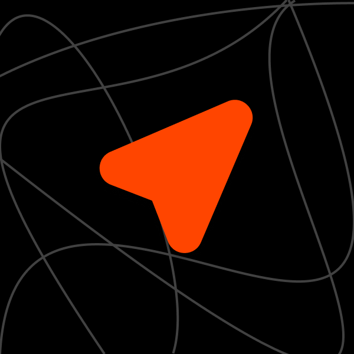

<h1 align="center"> AlgoDS</h1>

  

This repository covers the basics of Algorithms and Data Structures. We'll be diving into Python, Java and C++. 
The program is based off of various online tutorials and books. I will keep updating
the list of books and authors. Licensed under a Creative Commons licence.

## Content Covered 
+ [Sorting]()
+ [Searching]()
+ [Graphs]()
+ [Data Structures]()

## Implementations 
+ [Java Implementations](https://github.com/loej/AlgoDS/tree/master/Java)
+ [Python Implementations](https://github.com/loej/AlgoDS/tree/master/Python)
+ [C++ Implementations](https://github.com/loej/AlgoDS/tree/master/C%2B%2B)
+ [JS Implementations](https://github.com/loej/AlgoDS/tree/master/JavaScript)

## Referenced Books
+ [Automate the Boring Stuff with Python - Al Sweigart](http://automatetheboringstuff.com/)

+ [Cracking the Coding Interview - Gayle Laakmann McDowell](http://www.crackingthecodinginterview.com/)

+ [Problem Solving with Algorithms and Data Structures using Python -  Brad Miller and David Ranum, Luther College](https://runestone.academy/runestone/books/published/pythonds/index.html)

+ [Rutgers University CS112 Curriculum](https://github.com/USMC1941/CS112-Rutgers)

## Coding Bat Solutions
+ [Master List of Solutions](https://github.com/loej/AlgoDS/tree/master/Coding%20Bat%20Solutions)

